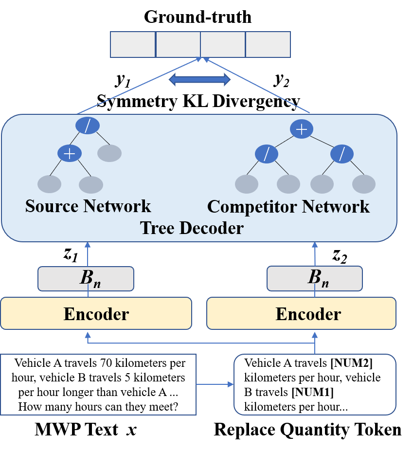

# ESIB: Expression Syntax Information Bottleneck for Math Word Problems

[](https://arxiv.org/abs/2310.15664)
[](https://www.python.org/)
[](https://pytorch.org/)

Open Source Code for **"Expression Syntax Information Bottleneck for Math Word Problems"** presented at **SIGIR 2022**.

## Model Architecture

<p align="center">
  
</p>

## Video Presentation

<p align="center">
  <a href="picture/SIGIR22-sp1591.mp4">
    
  </a>
</p>

<p align="center">
  <video src="picture/SIGIR22-sp1591.mp4" width="600" controls>
    Your browser does not support the video tag. <a href="picture/SIGIR22-sp1591.mp4">Download the video</a>.
  </video>
</p>

> 📺 **Note**: If the video doesn't play in your browser, you can [download it directly](picture/SIGIR22-sp1591.mp4) or view it locally after cloning the repository.

## Overview

This repository implements ESIB (Expression Syntax Information Bottleneck), a novel approach for solving Math Word Problems (MWPs). Our method leverages:

- **Variational Information Bottleneck (VIB)** for learning compressed representations
- **Multi-Task Learning (MT)** for improved generalization
- **Expression Syntax Trees** for structured mathematical reasoning

## Requirements

| Package | Version | Notes |
|---------|---------|-------|
| Python | 3.6.13 | |
| PyTorch | 1.9.1 | |
| Transformers | 4.3.0 | |
| tqdm | 4.60.0 | |
| pytorch_warmup | - | [Installation Guide](https://github.com/Tony-Y/pytorch_warmup) |
| chinese_roberta | - | [Download Link](https://drive.google.com/file/d/1eHM3l4fMo6DsQYGmey7UZGiTmQquHw25/view) (put in `src/chinese_roberta`) |

## Installation

```bash
# Clone the repository
git clone https://github.com/your-username/math_ESIB.git
cd math_ESIB

# Install dependencies
pip install transformers==4.3.0 tqdm==4.60.0 torch==1.9.1

# Install pytorch_warmup
pip install pytorch-warmup

# Download chinese_roberta and place in src/chinese_roberta
```

## Dataset

We evaluate on two Chinese math word problem datasets:

- **Math23K**: 23,162 problems with annotated equations
- **APE210K**: 210,000+ problems from the Ape-210K dataset

## Usage

### Configuration

Edit `src/config.py` to set:
- `USE_APE`: `True` for APE210K, `False` for Math23K
- `MODEL_NAME`: `'roberta'` or `'bert-base-chinese'`

### Running Experiments

#### Full Model (CN + SN) on APE210K
```bash
# Set USE_APE = True, MODEL_NAME = 'roberta' in src/config.py
python run_seq2tree_APE_early_SP_VAE.py
```

#### Full Model (CN + SN) on Math23K
```bash
# Set USE_APE = False, MODEL_NAME = 'roberta' in src/config.py
python run_seq2tree_bert_ultimate_divide_epoch_vae.py
```

#### Ablation Studies on Math23K

| Experiment | Script | Description |
|------------|--------|-------------|
| CN w/o MT | `run_seq2tree_bert_ultimate_comp_vae.py` | Without Multi-Task |
| CN w/o VIB | `run_seq2tree_bert_ultimate_divide_epoch.py` | Without Information Bottleneck |
| CN w/o MT+VIB | `run_seq2tree_bert_ultimate_comp.py` | Baseline without both |
| CN with V_sdl | `run_seq2tree_bert_ultimate_divide_dice.py` | With Dice Loss |

#### Using BERT instead of RoBERTa
```bash
# Set MODEL_NAME = 'bert-base-chinese' in src/config.py
python run_seq2tree_bert_ultimate_comp.py
# or
python run_seq2tree_bert_ultimate_comp_vae.py
```

## Project Structure

```
math_ESIB/
├── data/
│   ├── Math_23K.json              # Math23K dataset
│   ├── ape/                       # APE210K dataset
│   ├── train23k_processed.json    # Processed training data
│   ├── valid23k_processed.json    # Processed validation data
│   └── test23k_processed.json     # Processed test data
├── src/
│   ├── config.py                  # Configuration file
│   ├── models_vae_divide.py       # VAE model with division
│   ├── models_vae_dice.py         # VAE model with dice loss
│   ├── models_prune.py            # Pruned model
│   ├── train_and_evaluate_*.py    # Training scripts
│   └── expressions_transfer.py    # Expression tree utilities
├── picture/
│   └── model_arch1.png            # Model architecture figure
├── run_seq2tree_*.py              # Main execution scripts
├── requirement.txt                # Dependencies
└── README.md
```

## Results

Our method achieves state-of-the-art performance on both Math23K and APE210K datasets. Please refer to our paper for detailed experimental results.

## Citation

If you find this work useful, please cite our paper:

```bibtex
@inproceedings{xiong2022expression,
  title={Expression Syntax Information Bottleneck for Math Word Problems},
  author={Xiong, Jing and Zhong, Chengming and others},
  booktitle={Proceedings of the 45th International ACM SIGIR Conference on Research and Development in Information Retrieval},
  pages={1852--1857},
  year={2022},
  organization={ACM},
  doi={10.1145/3477495.3531826}
}
```

## Paper Link

📄 **arXiv**: [https://arxiv.org/abs/2310.15664](https://arxiv.org/abs/2310.15664)

## License

This project is for research purposes. Please contact the authors for commercial use.

## Acknowledgments

We thank the authors of the Math23K and APE210K datasets for making their data publicly available.
